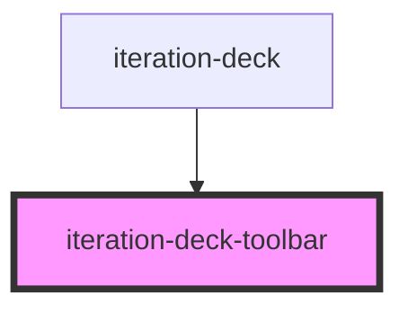

# iteration-deck-toolbar

Global navigation toolbar component that provides a centralized interface for controlling multiple `iteration-deck` instances on a page. Automatically created as a singleton by the first `iteration-deck` component.

## Core Features

- **Singleton pattern**: Only one toolbar exists per page, shared across all decks
- **Multi-deck support**: Dropdown selector when multiple decks are present
- **Keyboard shortcuts**: Ctrl/Cmd + Arrow keys for slide navigation
- **Visual design**: Pill-shaped floating toolbar with glassmorphism effect
- **Environment aware**: Only renders in development mode
- **Accessibility**: Full keyboard navigation and screen reader support

## Automatic Creation

The toolbar is automatically created by the first `iteration-deck` component on the page. No manual instantiation required:

```html
<!-- Toolbar auto-created when this renders -->
<iteration-deck deck-id="first-deck" label="My First Deck">
  <iteration-deck-slide label="Slide 1">...</iteration-deck-slide>
</iteration-deck>

<!-- Shares the same toolbar -->
<iteration-deck deck-id="second-deck" label="My Second Deck">
  <iteration-deck-slide label="Slide A">...</iteration-deck-slide>
</iteration-deck>
```

## Multi-Deck Behavior

### Single Deck
When only one deck is present:
- **No dropdown**: Deck selector hidden
- **Direct navigation**: Previous/Next buttons for slide navigation
- **Slide label**: Shows current slide name

### Multiple Decks
When multiple decks are present:
- **Deck dropdown**: Select which deck to control
- **Active deck focus**: Navigation applies only to selected deck
- **Visual feedback**: Selected deck gets attention glow effect

## Keyboard Shortcuts

The toolbar listens for global keyboard shortcuts:

- **Ctrl/Cmd + ←**: Previous slide (in active deck)
- **Ctrl/Cmd + →**: Next slide (in active deck)
- **Works globally**: Shortcuts work anywhere on the page
- **Active deck only**: Only affects the currently selected deck

## Visual Design

### Glassmorphism Effect
- **Semi-transparent background**: `rgba(255, 255, 255, 0.95)`
- **Backdrop blur**: `backdrop-filter: blur(10px)`
- **Soft shadows**: `box-shadow: 0 4px 20px rgba(0, 0, 0, 0.15)`

### Positioning
- **Fixed position**: Floating at bottom center of viewport
- **High z-index**: `z-index: 1000` to appear above content
- **Responsive**: Adapts to content width

### Button States
- **Active**: Blue background `#3b82f6` when navigation available
- **Disabled**: Gray background `#e5e7eb` when at deck boundaries
- **Hover effects**: Subtle transitions for better UX

## Environment Behavior

### Development Mode
- **Fully functional**: All features available
- **Visual feedback**: Attention effects and smooth animations
- **Keyboard shortcuts**: Global shortcut handling
- **Multi-deck support**: Dropdown selector for deck switching

### Production Mode
- **Hidden**: Component returns `null` and doesn't render
- **Zero overhead**: No DOM elements or event listeners created
- **Clean experience**: No development tools visible to end users

## Accessibility Features

### Keyboard Navigation
- **Tab navigation**: All controls accessible via Tab key
- **Enter/Space**: Activate buttons and dropdown
- **Arrow keys**: Navigate dropdown options
- **Global shortcuts**: Ctrl/Cmd + Arrow keys work from anywhere

### Screen Reader Support
- **ARIA labels**: All buttons have descriptive labels
- **Live regions**: State changes announced to screen readers
- **Semantic markup**: Proper button and select elements
- **Descriptive text**: Clear button titles and help text

### Touch Support
- **44px minimum**: All touch targets meet accessibility guidelines
- **Finger-friendly**: Adequate spacing between controls
- **Touch feedback**: Visual feedback for touch interactions

## State Management

The toolbar connects to a global Zustand store that manages:

- **Active deck ID**: Which deck is currently selected
- **Active slide index**: Current slide within the active deck
- **Deck registry**: List of all available decks on the page
- **Navigation state**: Enabled/disabled state of navigation buttons

## Usage with Frameworks

### React
```typescript
// Toolbar auto-created, no imports needed
function MyApp() {
  return (
    <div>
      <iteration-deck deck-id="deck1" label="Headers">
        <iteration-deck-slide label="Large">
          <LargeHeader />
        </iteration-deck-slide>
      </iteration-deck>
    </div>
  );
}
```

### Vue
```vue
<template>
  <div>
    <!-- Toolbar automatically appears -->
    <iteration-deck deck-id="deck1" label="Buttons">
      <iteration-deck-slide label="Primary">
        <PrimaryButton />
      </iteration-deck-slide>
    </iteration-deck>
  </div>
</template>
```

### Angular
```typescript
@Component({
  template: `
    <!-- Toolbar auto-created by first deck -->
    <iteration-deck deck-id="deck1" label="Cards">
      <iteration-deck-slide label="Standard">
        <app-card></app-card>
      </iteration-deck-slide>
    </iteration-deck>
  `
})
export class MyComponent {}
```

## Advanced Usage

### Custom Styling
While the toolbar uses inline styles for consistency, you can override them:

```css
iteration-deck-toolbar {
  /* Override default positioning */
  bottom: 40px !important;
}

iteration-deck-toolbar .toolbar {
  /* Customize glassmorphism effect */
  background: rgba(0, 0, 0, 0.8) !important;
  color: white !important;
}
```

### Programmatic Control
Access the toolbar through the global store:

```typescript
import { useIterationDeckStore } from 'iteration-deck/store';

const store = useIterationDeckStore.getState();

// Switch to a specific deck
store.setActiveDeck('my-deck-id');

// Navigate to a specific slide
store.setActiveSlide(2);
```

<!-- Auto Generated Below -->


## Dependencies

### Used by

 - [iteration-deck](../iteration-deck)

### Graph


----------------------------------------------

*Built with [StencilJS](https://stenciljs.com/)*
