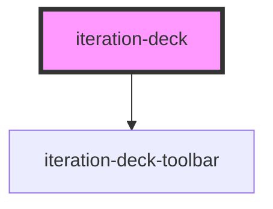

# iteration-deck

<!-- Auto Generated Below -->

## Properties

| Property              | Attribute      | Description                                        | Type                  | Default     |
| --------------------- | -------------- | -------------------------------------------------- | --------------------- | ----------- |
| `activeIndex`         | `active-index` | Currently active slide index                       | `number`              | `0`         |
| `deckId` _(required)_ | `deck-id`      | Unique identifier for this iteration deck          | `string`              | `undefined` |
| `description`         | `description`  | Additional context for stakeholder presentations   | `string \| undefined` | `undefined` |
| `label`               | `label`        | Label for this deck in the toolbar                 | `string \| undefined` | `undefined` |
| `prompt`              | `prompt`       | Optional AI prompt context for generation tracking | `string \| undefined` | `undefined` |

## Dependencies

### Depends on

- [iteration-deck-toolbar](../iteration-deck-toolbar)

### Graph

----------------------------------------------

*Built with [StencilJS](https://stenciljs.com/)*
