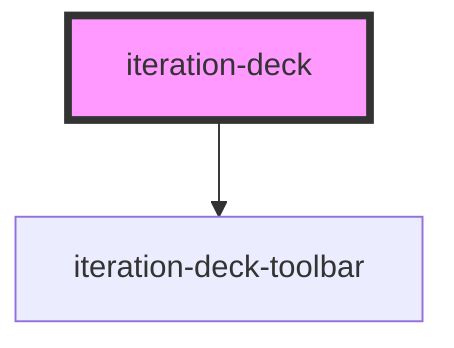

# iteration-deck

The main container component for **AI-first prototyping workflows** that enables designers and PMs to compare AI-generated UI variations interactively. Uses a slide deck metaphor where each AI-generated variation is a "slide" in the deck.

## Core Features

- **Multi-variation support**: Container for multiple UI variations using slot-based content
- **Environment-aware rendering**: Shows all slides in development, first slide only in production
- **Global state management**: Registers with singleton toolbar for navigation
- **Visual feedback**: Attention glow effects when deck becomes active
- **Auto-scroll**: Automatically scrolls into view when selected
- **AI metadata tracking**: Supports prompt and description context for AI workflows

## Basic Usage

```html
<!-- Basic usage -->
<iteration-deck deck-id="hero-layouts" label="Hero Sections">
  <iteration-deck-slide label="Centered Layout">
    <div class="hero-centered">
      <h1>Welcome</h1>
      <p>Centered hero layout</p>
    </div>
  </iteration-deck-slide>
  <iteration-deck-slide label="Split Layout">
    <div class="hero-split">
      <div class="content">...</div>
      <div class="image">...</div>
    </div>
  </iteration-deck-slide>
</iteration-deck>
```

## AI-Enhanced Usage

```html
<!-- AI-generated variations with metadata -->
<iteration-deck 
  deck-id="cta-buttons" 
  label="Call to Action Buttons"
  prompt="Create modern, accessible CTA buttons with 3 style variations"
  description="Testing different button styles for conversion optimization">
  
  <iteration-deck-slide 
    label="Primary" 
    ai-prompt="Make it bold and attention-grabbing"
    confidence="0.95">
    <button class="btn-primary">Get Started</button>
  </iteration-deck-slide>
  
  <iteration-deck-slide 
    label="Subtle" 
    ai-prompt="More understated, professional look"
    confidence="0.87"
    notes="Designer preferred this for B2B contexts">
    <button class="btn-outline">Get Started</button>
  </iteration-deck-slide>
</iteration-deck>
```

## Framework Integration

### React
```typescript
import { defineCustomElements } from 'iteration-deck/loader';

defineCustomElements();

function App() {
  return (
    <iteration-deck deck-id="headers" label="Page Headers">
      <iteration-deck-slide label="Standard">
        <Header variant="standard" />
      </iteration-deck-slide>
      <iteration-deck-slide label="Compact">
        <Header variant="compact" />
      </iteration-deck-slide>
    </iteration-deck>
  );
}
```

### Vue
```vue
<template>
  <iteration-deck deck-id="buttons" label="CTA Buttons">
    <iteration-deck-slide label="Primary">
      <MyButton variant="primary">Click Me</MyButton>
    </iteration-deck-slide>
    <iteration-deck-slide label="Secondary">
      <MyButton variant="secondary">Click Me</MyButton>
    </iteration-deck-slide>
  </iteration-deck>
</template>

<script>
import { defineCustomElements } from 'iteration-deck/loader';
defineCustomElements();
</script>
```

## Environment Behavior

### Development Mode
- **All slides rendered**: Switch between variations using toolbar or keyboard shortcuts
- **Visual feedback**: Attention glow and auto-scroll when deck becomes active
- **Slide indicators**: Shows dots and labels for each variation
- **Keyboard shortcuts**: Ctrl/Cmd + Arrow keys for navigation (when deck is active)

### Production Mode
- **First slide only**: Renders only the first `<iteration-deck-slide>`
- **No toolbar**: Clean rendering without development tools
- **Static behavior**: Acts like a regular HTML container

## Accessibility

- **ARIA compliance**: Proper labeling and roles for slide navigation
- **Keyboard navigation**: Full keyboard support for slide switching
- **Screen reader support**: Descriptive labels and state announcements
- **Touch targets**: 44px minimum size for interactive elements

<!-- Auto Generated Below -->


## Properties

| Property              | Attribute      | Description                                        | Type                  | Default     |
| --------------------- | -------------- | -------------------------------------------------- | --------------------- | ----------- |
| `activeIndex`         | `active-index` | Currently active slide index                       | `number`              | `0`         |
| `deckId` _(required)_ | `deck-id`      | Unique identifier for this iteration deck          | `string`              | `undefined` |
| `description`         | `description`  | Additional context for stakeholder presentations   | `string \| undefined` | `undefined` |
| `label`               | `label`        | Label for this deck in the toolbar                 | `string \| undefined` | `undefined` |
| `prompt`              | `prompt`       | Optional AI prompt context for generation tracking | `string \| undefined` | `undefined` |


## Dependencies

### Depends on

- [iteration-deck-toolbar](../iteration-deck-toolbar)

### Graph


----------------------------------------------

*Built with [StencilJS](https://stenciljs.com/)*
